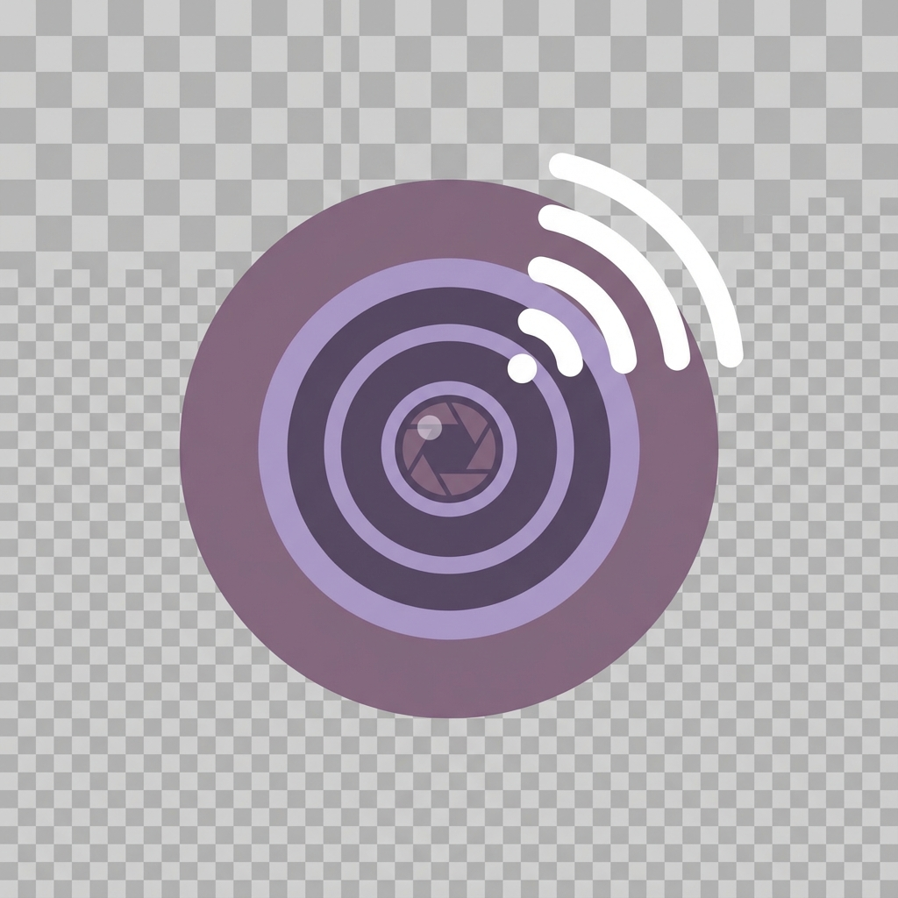

# RemoteWebCam

<div align="center">



**Turn your phone into a high-quality webcam for your PC** 🎥

[](https://opensource.org/licenses/MIT)
[](https://www.android.com)
[](https://www.microsoft.com/windows)
[](https://github.com/AbQaadir/RemoteWebCam)

🌐 **[Visit Website](https://abqaadir.github.io/RemoteWebCam/)** • 
📱 **[Download APK](https://github.com/AbQaadir/RemoteWebCam/releases/latest/download/RemoteWebCam.apk)** • 
💻 **[Download Windows](https://github.com/AbQaadir/RemoteWebCam/releases/latest/download/RemoteWebcam.exe)**

</div>

---

## ✨ Features

- 🔒 **Privacy First** - All data stays on your local network, no cloud required
- 📶 **Wi-Fi & USB** - Connect via Wi-Fi or USB (ADB port forwarding)
- 🎥 **Virtual Camera** - Works with Zoom, Teams, Google Meet, OBS, and more
- 📱 **Full-Screen Preview** - Modern, immersive camera UI on Android
- 🔄 **Camera Switching** - Easily switch between front and back cameras
- 📊 **Resolution Options** - Choose 480p, 720p, or 1080p quality
- 🌙 **Dark Theme** - Beautiful lavender-purple dark theme
- ⚡ **Low Latency** - Optimized for real-time streaming

## 🚀 Quick Start

### 1. Install OBS Studio (Required for Virtual Camera)

Download and install [OBS Studio](https://obsproject.com/) - this provides the virtual camera driver.

### 2. Download the Apps

| Platform | Download | Requirements |
|----------|----------|--------------|
| 📱 Android | [RemoteWebCam.apk](https://github.com/AbQaadir/RemoteWebCam/releases/latest/download/RemoteWebCam.apk) | Android 5.0+ |
| 💻 Windows | [RemoteWebcam.exe](https://github.com/AbQaadir/RemoteWebCam/releases/latest/download/RemoteWebcam.exe) | Windows 10+ |

### 3. Connect and Stream

1. **Open the Android app** on your phone
2. **Tap the record button** to start streaming
3. **Note the IP address** shown on screen
4. **Open the Windows app** on your PC
5. **Enter the IP address** and click Connect
6. **Enable Virtual Camera** to use in video calls!

## 🔌 Connection Methods

### Wi-Fi Connection (Recommended)
1. Connect both devices to the same Wi-Fi network
2. Enter the IP address shown on the phone app
3. Click Connect

### USB Connection
1. Connect phone to PC via USB cable
2. Enable USB Debugging on phone
3. Select your device from the USB dropdown
4. The app will automatically set up ADB port forwarding

## 🛠️ Building from Source

### Android App

```bash
cd android-app
./gradlew assembleDebug
# APK will be in app/build/outputs/apk/debug/
```

### Desktop App

```bash
cd desktop-app
pip install -r requirements.txt
python main.py

# To build standalone executable:
pip install pyinstaller
pyinstaller RemoteWebcam.spec
```

## 📋 Requirements

### Android
- Android 5.0 (API 21) or higher
- Camera permission
- Wi-Fi connection (or USB cable)

### Windows
- Windows 10 or higher
- OBS Studio (for virtual camera)
- ADB (optional, for USB connection)

## 🤝 Contributing

Contributions are welcome! Please read our [Contributing Guidelines](CONTRIBUTING.md) and [Code of Conduct](CODE_OF_CONDUCT.md).

## 📄 License

This project is licensed under the MIT License - see the [LICENSE](LICENSE) file for details.

## 🙏 Acknowledgments

- [NanoHTTPD](https://github.com/NanoHttpd/nanohttpd) - Lightweight HTTP server for Android
- [PyVirtualCam](https://github.com/letmaik/pyvirtualcam) - Virtual camera support for Python
- [OBS Studio](https://obsproject.com/) - Virtual camera driver

---

<div align="center">

**[🌐 Website](https://abqaadir.github.io/RemoteWebCam/)** • 
**[⭐ Star on GitHub](https://github.com/AbQaadir/RemoteWebCam)** • 
**[🐛 Report Bug](https://github.com/AbQaadir/RemoteWebCam/issues)**

Made with ❤️ by [AbQaadir](https://github.com/AbQaadir)

</div>
